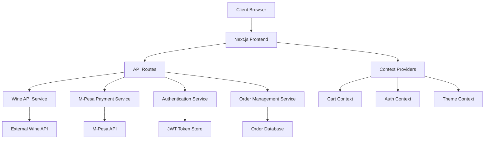

# Design Document

## Overview

The wine e-commerce platform will be built as a Next.js application with TypeScript, leveraging the existing Tailwind CSS setup for styling. The platform features a sophisticated black and red color scheme that evokes elegance and luxury, appropriate for wine commerce. The architecture supports both online customer interactions and staff/admin functionality for in-store operations.

## Architecture

### Frontend Architecture
- **Framework**: Next.js 15.3.3 with React 19
- **Language**: TypeScript for type safety
- **Styling**: Tailwind CSS 4 for responsive design
- **State Management**: React Context API for global state (cart, user session)
- **Authentication**: JWT-based authentication with role-based access control

### Backend Architecture
- **API Routes**: Next.js API routes for backend functionality
- **Database**: Integration with external wine API (as shown in provided endpoints)
- **Payment Processing**: M-Pesa API integration and cash transaction logging
- **Authentication**: JWT tokens with role-based permissions (customer, staff, admin)

### System Architecture Diagram



## Components and Interfaces

### Core Components

#### 1. Layout Components
- **Header**: Navigation with logo, search, cart icon, and user authentication
- **Footer**: Company information, links, and social media
- **Sidebar**: Category filtering and wine attributes
- **Layout**: Main wrapper component with consistent styling

#### 2. Wine Display Components
- **WineCard**: Individual wine display with image, name, price, and quick actions
- **WineGrid**: Responsive grid layout for wine catalog
- **WineDetail**: Detailed wine information page with ingredients, history, and purchase options
- **WineCarousel**: Featured wines showcase on homepage

#### 3. E-commerce Components
- **Cart**: Shopping cart with item management
- **Checkout**: Multi-step checkout process
- **PaymentForm**: M-Pesa integration and payment processing
- **OrderSummary**: Order confirmation and details
- **OrderHistory**: Customer order tracking

#### 4. Staff/Admin Components
- **StaffLogin**: Authentication for staff members
- **StaffDashboard**: Overview of sales and inventory
- **POSSystem**: Point of sale for in-store transactions
- **InventoryManager**: Wine inventory management
- **SalesReports**: Analytics and reporting

### Interface Definitions

```typescript
// Core Data Interfaces
interface Wine {
  id: string;
  name: string;
  description: string;
  price: number;
  image: string;
  ingredients: string[];
  color: string;
  history: string;
  vintage: number;
  region: string;
  alcoholContent: number;
  category: string;
  inStock: boolean;
  stockQuantity: number;
}

interface User {
  id: string;
  email: string;
  name: string;
  role: 'customer' | 'staff' | 'admin';
  createdAt: Date;
}

interface CartItem {
  wine: Wine;
  quantity: number;
}

interface Order {
  id: string;
  userId: string;
  items: CartItem[];
  total: number;
  paymentMethod: 'mpesa' | 'cash';
  paymentStatus: 'pending' | 'completed' | 'failed';
  orderStatus: 'processing' | 'completed' | 'cancelled';
  createdAt: Date;
}

interface Staff {
  id: string;
  name: string;
  email: string;
  role: 'staff' | 'admin';
  permissions: string[];
}
```

## Data Models

### Wine Management
- **Wine Catalog**: Comprehensive wine information with rich metadata
- **Categories**: Wine categorization (red, white, rosé, sparkling, etc.)
- **Inventory**: Stock levels and availability tracking
- **Pricing**: Dynamic pricing with promotional capabilities

### User Management
- **Customer Profiles**: Personal information and preferences
- **Staff Accounts**: Role-based access with permissions
- **Authentication**: Secure login with JWT tokens
- **Session Management**: Persistent login state

### Order Processing
- **Shopping Cart**: Temporary item storage with persistence
- **Order Lifecycle**: From cart to completion with status tracking
- **Payment Records**: Transaction history and reconciliation
- **Receipts**: Digital and printable receipt generation

## Error Handling

### Frontend Error Handling
- **API Error Boundaries**: Graceful handling of API failures
- **Form Validation**: Real-time validation with user-friendly messages
- **Network Errors**: Offline detection and retry mechanisms
- **Payment Failures**: Clear error messages with recovery options

### Backend Error Handling
- **API Response Standards**: Consistent error response format
- **Logging**: Comprehensive error logging for debugging
- **Fallback Mechanisms**: Graceful degradation when services are unavailable
- **Rate Limiting**: Protection against abuse and overload

### Error Response Format
```typescript
interface ApiError {
  success: false;
  error: {
    code: string;
    message: string;
    details?: any;
  };
}

interface ApiSuccess<T> {
  success: true;
  data: T;
}
```

## Testing Strategy

### Unit Testing
- **Component Testing**: React Testing Library for component behavior
- **API Testing**: Jest for API route testing
- **Utility Testing**: Pure function testing for business logic
- **Mock Services**: Mocked external API calls

### Integration Testing
- **E2E Testing**: Playwright for complete user workflows
- **Payment Testing**: M-Pesa sandbox environment testing
- **Authentication Flow**: Complete login/logout scenarios
- **Cart to Checkout**: Full purchase flow testing

### Performance Testing
- **Load Testing**: API endpoint performance under load
- **Frontend Performance**: Core Web Vitals optimization
- **Image Optimization**: Next.js Image component usage
- **Bundle Analysis**: Code splitting and optimization

## Design System

### Color Palette
```css
:root {
  /* Primary Colors */
  --wine-black: #1a1a1a;
  --wine-red: #8b0000;
  --wine-red-light: #a52a2a;
  --wine-red-dark: #660000;
  
  /* Accent Colors */
  --gold-accent: #d4af37;
  --cream: #f5f5dc;
  --charcoal: #36454f;
  
  /* Neutral Colors */
  --white: #ffffff;
  --light-gray: #f8f8f8;
  --medium-gray: #666666;
  --dark-gray: #333333;
}
```

### Typography
- **Primary Font**: Elegant serif font for headings (Playfair Display)
- **Secondary Font**: Clean sans-serif for body text (Inter)
- **Accent Font**: Script font for special elements (Dancing Script)

### Interactive Elements
- **Hover Effects**: Subtle animations and color transitions
- **Loading States**: Elegant loading spinners and skeletons
- **Micro-interactions**: Button feedback and form interactions
- **Responsive Behavior**: Smooth transitions between breakpoints

## Security Considerations

### Authentication Security
- **JWT Implementation**: Secure token generation and validation
- **Role-based Access**: Granular permission system
- **Session Management**: Secure session handling and expiration
- **Password Security**: Hashing and validation requirements

### Payment Security
- **M-Pesa Integration**: Secure API communication with encryption
- **PCI Compliance**: Adherence to payment card industry standards
- **Transaction Logging**: Secure audit trail for all transactions
- **Data Protection**: Encryption of sensitive customer data

### API Security
- **Rate Limiting**: Protection against API abuse
- **Input Validation**: Comprehensive request validation
- **CORS Configuration**: Proper cross-origin resource sharing
- **Error Information**: Limited error details in production

## Performance Optimization

### Frontend Optimization
- **Code Splitting**: Dynamic imports for route-based splitting
- **Image Optimization**: Next.js Image component with WebP support
- **Caching Strategy**: Browser caching and service worker implementation
- **Bundle Optimization**: Tree shaking and dead code elimination

### Backend Optimization
- **API Caching**: Redis caching for frequently accessed data
- **Database Optimization**: Efficient queries and indexing
- **CDN Integration**: Static asset delivery optimization
- **Compression**: Gzip compression for API responses

## Deployment Architecture

### Production Environment
- **Hosting**: Vercel deployment with Next.js optimization
- **Database**: External API integration with fallback mechanisms
- **CDN**: Image and static asset delivery
- **Monitoring**: Error tracking and performance monitoring

### Development Environment
- **Local Development**: Next.js dev server with hot reloading
- **API Mocking**: Development API endpoints for testing
- **Environment Variables**: Secure configuration management
- **Testing Pipeline**: Automated testing on commits